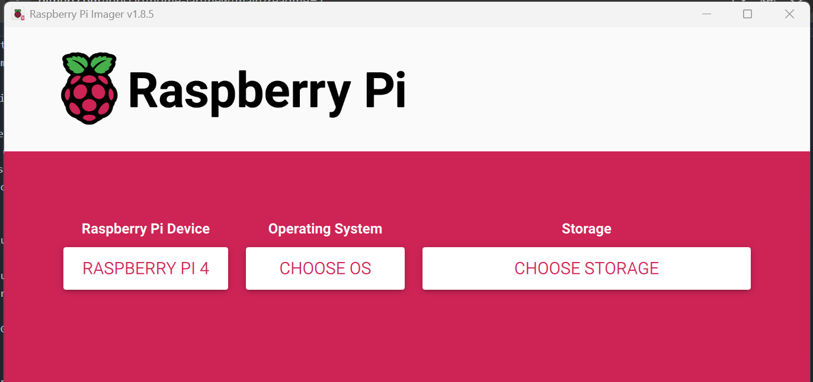

#Home Lab com Raspberry Pi e Umbrel OS
🚀 Sobre o Projeto
Este repositório documenta meu Home Lab, montado com um Raspberry Pi rodando Umbrel OS. O objetivo é explorar administração de sistemas, segurança de redes e integração com a nuvem, começando com a instalação do Pi-hole, um bloqueador de anúncios em nível de rede.

🛠 Tecnologias e Ferramentas

🖥️ Hardware: Raspberry Pi
🏠 Sistema Operacional: Umbrel OS
🔗 Serviços Configurados:
Pi-hole (Bloqueio de anúncios e rastreadores)

 #1. Configuração do Raspberry Pi

  Hardware usados nesse projeto 
  - raspybarry Pi 4 model B
  - Sd card 32gb
  - Ssd 256Gb

#2. Baixe a imagem mais recente do Umbrel OS 
 - link https://umbrel.com/update-to-umbrelos-1-0
 - Para instalar a imagem no cartao SD utilizei o proprio software da Raspybarry que voce encontra nesse link: https://www.raspberrypi.com/software/
 - 

 
